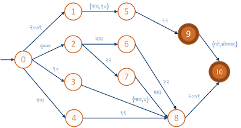

# Universal-DateType-in-Nepali
Date type representation in Nepali(Devanagari) text. 

-----
During my corpus collection work in Nepali, I wanted to understand all types/formats of dates available in the News sources. Many news sources keep their date information in  different formats. For example: eKantipur uses २०७२ श्रावण ५ ०८:३१  format where as Nagarik News uses मङ्गलबार ५ श्रावण, २०७२ format and so on.  The diagrammatic representation of the system in state machine is given below.



My intuition is to make the corpus searchable too. So, I wrote a Java program that understands different formats of Nepalese date and index it into sort-able format. 

#### Usage:
```Java
        String textDate = "२०७१ फाल्गुन १० आइतबार";
        NepaliDate instance = new NepaliDate(textDate);
        boolean result = instance.IsValid();
        System.out.println("Date " + textDate + " is " + result + ".");
```
